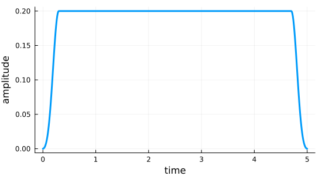
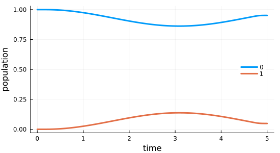
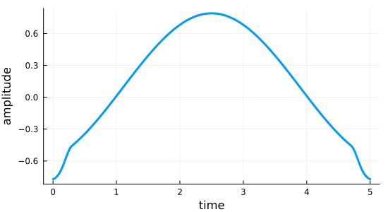
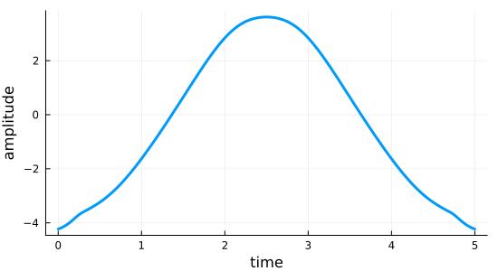
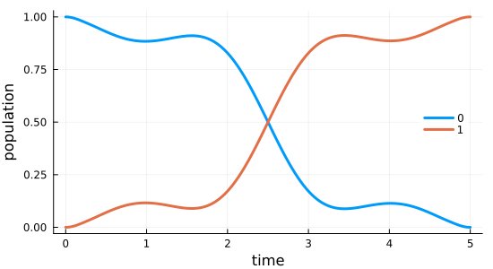

```@meta
EditURL = "simple_state_to_state.jl"
```

# Optimization of a State-to-State Transfer in a Two-Level-System

``\gdef\op#1{\hat{#1}}``
``\gdef\init{\text{init}}``
``\gdef\tgt{\text{tgt}}``


This first example illustrates the basic use of the `GRAPE.jl` by solving a simple canonical optimization problem: the transfer of population in a two level system.

````julia
datadir(names...) = joinpath(@__DIR__, names...)

using QuantumControl
using QuantumPropagators: ExpProp
````

## Two-level Hamiltonian

We consider the Hamiltonian ``\op{H}_{0} = - \frac{\omega}{2} \op{\sigma}_{z}``, representing a simple qubit with energy level splitting ``\omega`` in the basis ``\{\ket{0},\ket{1}\}``. The control field ``\epsilon(t)`` is assumed to couple via the Hamiltonian ``\op{H}_{1}(t) = \epsilon(t) \op{\sigma}_{x}`` to the qubit, i.e., the control field effectively drives transitions between both qubit states.

````julia
ϵ(t) = 0.2 * QuantumControl.Shapes.flattop(t, T=5, t_rise=0.3, func=:blackman);
````

````julia
"""Two-level-system Hamiltonian."""
function tls_hamiltonian(Ω=1.0, ϵ=ϵ)
    σ̂_z = ComplexF64[
        1  0
        0 -1
    ]
    σ̂_x = ComplexF64[
        0  1
        1  0
    ]
    Ĥ₀ = -0.5 * Ω * σ̂_z
    Ĥ₁ = σ̂_x
    return hamiltonian(Ĥ₀, (Ĥ₁, ϵ))
end;
````

````julia
H = tls_hamiltonian();
````

The control field here switches on from zero at ``t=0`` to it's maximum amplitude 0.2 within the time period 0.3 (the switch-on shape is half a [Blackman pulse](https://en.wikipedia.org/wiki/Window_function#Blackman_window)). It switches off again in the time period 0.3 before the final time ``T=5``). We use a time grid with 500 time steps between 0 and ``T``:

````julia
tlist = collect(range(0, 5, length=500));
````

````julia
using Plots
Plots.default(
    linewidth               = 3,
    size                    = (550, 300),
    legend                  = :right,
    foreground_color_legend = nothing,
    background_color_legend = RGBA(1, 1, 1, 0.8)
)
````

````julia
function plot_control(pulse::Vector, tlist)
    plot(tlist, pulse, xlabel="time", ylabel="amplitude", legend=false)
end

plot_control(ϵ::Function, tlist) = plot_control([ϵ(t) for t in tlist], tlist);
````

````julia
fig = plot_control(ϵ, tlist)
````


## Optimization target

First, we define a convenience function for the eigenstates.

````julia
function ket(label)
    result = Dict("0" => Vector{ComplexF64}([1, 0]), "1" => Vector{ComplexF64}([0, 1]))
    return result[string(label)]
end;
````

The physical objective of our optimization is to transform the initial state ``\ket{0}`` into the target state ``\ket{1}`` under the time evolution induced by the Hamiltonian ``\op{H}(t)``.

````julia
trajectories = [Trajectory(initial_state=ket(0), generator=H, target_state=ket(1))];
````

The full control problem includes this trajectory, information about the time grid for the dynamics, and the functional to be used (the square modulus of the overlap ``\tau`` with the target state in this case).

````julia
using QuantumControl.Functionals: J_T_sm

problem = ControlProblem(
    trajectories=trajectories,
    tlist=tlist,
    iter_stop=500,
    prop_method=ExpProp,
    pulse_options=Dict(),
    J_T=J_T_sm,
    check_convergence=res -> begin
        ((res.J_T < 1e-3) && (res.converged = true) && (res.message = "J_T < 10⁻³"))
    end,
);
````

## Simulate dynamics under the guess field

Before running the optimization procedure, we first simulate the dynamics under the guess field ``\epsilon_{0}(t)``. The following solves equation of motion for the defined trajectory, which contains the initial state ``\ket{\Psi_{\init}}`` and the Hamiltonian ``\op{H}(t)`` defining its evolution.

````julia
guess_dynamics = propagate_trajectory(
    trajectories[1],
    problem.tlist;
    method=ExpProp,
    storage=true,
    observables=(Ψ -> abs.(Ψ) .^ 2,)
)
````

````
2×500 Matrix{Float64}:
 1.0  1.0          1.0          1.0          …  0.951457   0.951459  0.951459
 0.0  7.73456e-40  2.03206e-11  2.96638e-10     0.0485427  0.048541  0.048541
````

````julia
function plot_population(pop0::Vector, pop1::Vector, tlist)
    fig = plot(tlist, pop0, label="0", xlabel="time", ylabel="population")
    plot!(fig, tlist, pop1; label="1")
end;
````

````julia
fig = plot_population(guess_dynamics[1, :], guess_dynamics[2, :], tlist)
````


## Optimization with LBFGSB

In the following we optimize the guess field ``\epsilon_{0}(t)`` such that the intended state-to-state transfer ``\ket{\Psi_{\init}} \rightarrow \ket{\Psi_{\tgt}}`` is solved.

The GRAPE package performs the optimization by calculating the gradient of ``J_T`` with respect to the values of the control field at each point in time. This gradient is then fed into a backend solver that calculates an appropriate update based on that gradient.

````julia
using GRAPE
````

By default, this backend is [`LBFGSB.jl`](https://github.com/Gnimuc/LBFGSB.jl), a wrapper around the true and tested [L-BFGS-B Fortran library](http://users.iems.northwestern.edu/%7Enocedal/lbfgsb.html). L-BFGS-B is a pseudo-Hessian method: it efficiently estimates the second-order Hessian from the gradient information. The search direction determined from that Hessian dramatically improves convergence compared to using the gradient directly as a search direction. The L-BFGS-B method performs its own linesearch to determine how far to go in the search direction.

````julia
opt_result_LBFGSB = @optimize_or_load(
    datadir("TLS", "GRAPE_opt_result_LBFGSB.jld2"),
    problem;
    method=GRAPE,
    prop_method=ExpProp,
);
````

````
[ Info: Set callback to store result in TLS/GRAPE_opt_result_LBFGSB.jld2 on unexpected exit.
 iter.        J_T       ǁ∇Jǁ       ǁΔϵǁ         ΔJ   FG(F)    secs
     0   9.51e-01   5.40e-02        n/a        n/a    1(0)     1.4
     1   9.49e-01   5.40e-02   5.40e-02  -2.95e-03    1(0)     0.2
     2   3.94e-02   5.55e-02   9.54e+00  -9.09e-01    6(0)     0.0
     3   1.65e-02   6.30e-02   1.34e+00  -2.29e-02    2(0)     0.0
     4   1.27e-02   3.82e-02   1.64e+00  -3.84e-03    1(0)     0.0
     5   1.65e-05   3.35e-02   7.42e-01  -1.27e-02    1(0)     0.0


````

````julia
opt_result_LBFGSB
````

````
GRAPE Optimization Result
-------------------------
- Started at 2024-12-02T17:24:43.961
- Number of trajectories: 1
- Number of iterations: 5
- Number of pure func evals: 0
- Number of func/grad evals: 12
- Value of functional: 1.65005e-05
- Reason for termination: J_T < 10⁻³
- Ended at 2024-12-02T17:24:45.633 (1 second, 672 milliseconds)

````

We can plot the optimized field:

````julia
fig = plot_control(opt_result_LBFGSB.optimized_controls[1], tlist)  # This is test
````


## Optimization via semi-automatic differentiation

Our GRAPE implementation includes the analytic gradient of the optimization functional `J_T_sm`. Thus, we only had to pass the functional itself to the optimization. More generally, for functionals where the analytic gradient is not known, semi-automatic differentiation can be used to determine it automatically. For illustration, we may re-run the optimization forgoing the known analytic gradient and instead using an automatically determined gradient.

As shown in Goerz et al., arXiv:2205.15044, by evaluating the gradient of ``J_T`` via a chain rule in the propagated states, the dependency of the gradient on the final time functional is pushed into the boundary condition for the backward propagation, ``|χ_k⟩ = -∂J_T/∂⟨ϕ_k|``. For functionals that can be written in terms of the overlaps ``τ_k`` of the forward-propagated states and target states, such as the `J_T_sm` used here, a further chain rule leaves derivatives of `J_T` with respect to the overlaps ``τ_k``, which are easily obtained via automatic differentiation. The `optimize` function takes an optional parameter `chi` that may be passed a function to calculate ``|χ_k⟩``. A suitable function can be obtained using

````julia
using QuantumControl.Functionals: make_chi
````

To force `make_chi` to use automatic differentiation, we must first load a suitable AD framework

````julia
using Zygote
````

Then, we can pass `mode=:automatic` and `automatic=Zygote` to `make_chi`:

````julia
chi_sm = make_chi(J_T_sm, trajectories; mode=:automatic, automatic=Zygote)
````

````
(::QuantumControlZygoteExt.var"#zygote_chi_via_tau#6"{QuantumControlZygoteExt.var"#zygote_chi_via_tau#2#7"{typeof(QuantumControl.Functionals.J_T_sm)}}) (generic function with 1 method)
````

The resulting `chi_sm` can be used in the optimization:

````julia
opt_result_LBFGSB_via_χ = optimize(problem; method=GRAPE, chi=chi_sm);
````

````
 iter.        J_T       ǁ∇Jǁ       ǁΔϵǁ         ΔJ   FG(F)    secs
     0   9.51e-01   5.40e-02        n/a        n/a    1(0)     8.3
     1   9.49e-01   5.40e-02   5.40e-02  -2.95e-03    1(0)     0.1
     2   3.94e-02   5.55e-02   9.54e+00  -9.09e-01    6(0)     0.0
     3   1.65e-02   6.30e-02   1.34e+00  -2.29e-02    2(0)     0.0
     4   1.27e-02   3.82e-02   1.64e+00  -3.84e-03    1(0)     0.0
     5   1.65e-05   3.35e-02   7.42e-01  -1.27e-02    1(0)     0.0

````

````julia
opt_result_LBFGSB_via_χ
````

````
GRAPE Optimization Result
-------------------------
- Started at 2024-12-02T17:25:10.892
- Number of trajectories: 1
- Number of iterations: 5
- Number of pure func evals: 0
- Number of func/grad evals: 12
- Value of functional: 1.65005e-05
- Reason for termination: J_T < 10⁻³
- Ended at 2024-12-02T17:25:19.318 (8 seconds, 426 milliseconds)

````

## Optimization with Optim.jl

As an alternative to the default L-BFGS-B backend, we can also use any of the gradient-based optimizers in [`Optim.jl`](https://github.com/JuliaNLSolvers/Optim.jl). This also gives full control over the linesearch method.

````julia
import Optim
import LineSearches
````

Here, we use the LBFGS implementation that is part of `Optim` (which is not exactly the same as L-BFGS-B; "B" being the variant of LBFGS with optional additional bounds on the control) with a Hager-Zhang linesearch

````julia
opt_result_OptimLBFGS = @optimize_or_load(
    datadir("TLS", "GRAPE_opt_result_OptimLBFGS.jld2"),
    problem;
    method=GRAPE,
    optimizer=Optim.LBFGS(;
        alphaguess=LineSearches.InitialStatic(alpha=0.2),
        linesearch=LineSearches.HagerZhang(alphamax=2.0)
    ),
);
````

````
[ Info: Set callback to store result in TLS/GRAPE_opt_result_OptimLBFGS.jld2 on unexpected exit.
     1   9.51e-01   0.00e+00   0.00e+00   9.51e-01    1(0)     1.0
     2   9.45e-01   5.40e-02   1.08e-01  -5.99e-03    3(0)     0.1
     3   9.39e-01   5.71e-02   1.14e-01  -6.72e-03    3(0)     0.0
     4   9.31e-01   6.04e-02   1.21e-01  -7.52e-03    3(0)     0.0
     5   9.23e-01   6.39e-02   1.28e-01  -8.41e-03    3(0)     0.0
     6   9.13e-01   6.76e-02   1.35e-01  -9.39e-03    3(0)     0.0
     7   9.03e-01   7.14e-02   1.43e-01  -1.05e-02    3(0)     0.0
     8   8.91e-01   7.53e-02   1.51e-01  -1.16e-02    3(0)     0.0
     9   8.78e-01   7.94e-02   1.59e-01  -1.29e-02    3(0)     0.0
    10   8.64e-01   8.35e-02   1.67e-01  -1.43e-02    3(0)     0.0
    11   8.48e-01   8.78e-02   1.76e-01  -1.58e-02    3(0)     0.0
    12   8.31e-01   9.22e-02   1.84e-01  -1.74e-02    3(0)     0.1
    13   8.12e-01   9.66e-02   1.93e-01  -1.91e-02    3(0)     0.0
    14   7.91e-01   1.01e-01   2.02e-01  -2.08e-02    3(0)     0.0
    15   7.68e-01   1.05e-01   2.11e-01  -2.26e-02    3(0)     0.0
    16   7.44e-01   1.10e-01   2.19e-01  -2.45e-02    3(0)     0.0
    17   7.18e-01   1.14e-01   2.27e-01  -2.63e-02    3(0)     0.0
    18   6.90e-01   1.17e-01   2.35e-01  -2.80e-02    3(0)     0.0
    19   6.60e-01   1.21e-01   2.42e-01  -2.97e-02    3(0)     0.0
    20   6.29e-01   1.24e-01   2.49e-01  -3.12e-02    3(0)     0.0
    21   5.96e-01   1.27e-01   2.54e-01  -3.26e-02    3(0)     0.0
    22   5.62e-01   1.29e-01   2.59e-01  -3.37e-02    3(0)     0.0
    23   5.28e-01   1.31e-01   2.62e-01  -3.45e-02    3(0)     0.0
    24   4.93e-01   1.32e-01   2.64e-01  -3.50e-02    3(0)     0.0
    25   4.58e-01   1.33e-01   2.65e-01  -3.51e-02    3(0)     0.0
    26   7.25e-02   1.32e-01   5.28e+01  -3.85e-01    2(0)     0.0
    27   1.68e-02   4.32e-02   2.54e+00  -5.57e-02    2(0)     0.0
    28   2.50e-05   4.51e-02   1.11e+00  -1.68e-02    3(0)     0.0


````

````julia
opt_result_OptimLBFGS
````

````
GRAPE Optimization Result
-------------------------
- Started at 2024-12-02T17:24:57.333
- Number of trajectories: 1
- Number of iterations: 28
- Number of pure func evals: 0
- Number of func/grad evals: 80
- Value of functional: 2.49647e-05
- Reason for termination: J_T < 10⁻³
- Ended at 2024-12-02T17:24:58.990 (1 second, 657 milliseconds)

````

We can plot the optimized field:

````julia
fig = plot_control(opt_result_OptimLBFGS.optimized_controls[1], tlist)
````


We can see that the choice of linesearch parameters in particular strongly influence the convergence and the resulting field. Play around with different methods and parameters!

Empirically, we find the default L-BFGS-B to have a very well-behaved linesearch.

## Simulate the dynamics under the optimized field

Having obtained the optimized control field, we can simulate the dynamics to verify that the optimized field indeed drives the initial state ``\ket{\Psi_{\init}} = \ket{0}`` to the desired target state ``\ket{\Psi_{\tgt}} = \ket{1}``.

````julia
using QuantumControl.Controls: substitute

opt_dynamics = propagate_trajectory(
    substitute(trajectories[1], IdDict(ϵ => opt_result_LBFGSB.optimized_controls[1])),
    problem.tlist;
    method=ExpProp,
    storage=true,
    observables=(Ψ -> abs.(Ψ) .^ 2,)
)
````

````
2×500 Matrix{Float64}:
 1.0  0.99994     0.999762     …  0.000174609  3.65549e-5  1.65005e-5
 0.0  5.96719e-5  0.000237653     0.999825     0.999963    0.999983
````

````julia
fig = plot_population(opt_dynamics[1, :], opt_dynamics[2, :], tlist)
````


